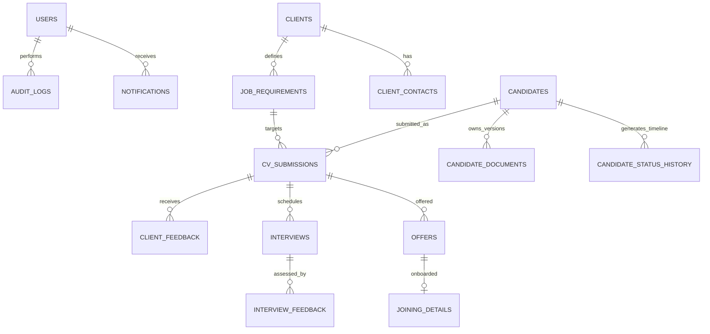

# RecruitFlow — Recruitment Management & Applicant Tracking Platform


**RecruitFlow** is a production-grade, enterprise SaaS Recruitment Management and Applicant Tracking Platform (ATS) designed to manage the entire talent acquisition lifecycle: from client requirements creation, candidate sourcing, multi-version CV storage, client submissions pipeline, interview coordination, and offer release to candidate onboarding.

Built with **FastAPI**, **SQLAlchemy**, **PostgreSQL 17**, **Vite**, **React 19**, **TypeScript**, and **Tailwind CSS**, RecruitFlow strictly enforces **never losing recruitment history** through immutable audit logs, sequential candidate timeline event tracking, and non-destructive document versioning.

---

## 🚀 Key Architectural Pillars

1. **Immutable Recruitment History**: When candidate lifecycle status transitions from one stage to another, the system records an immutable entry in `candidate_status_history` storing timestamp, stage duration (hours), actor, old status, new status, and remarks.
2. **Multi-Version CV Architecture**: Support for incremental resume versions (`Resume v1`, `Resume v2`, `Resume v3`). Prior versions are preserved permanently with file hashing and download endpoints.
3. **Multi-Tier Role-Based Access Control (RBAC)**: 7 granular authorization levels enforced at both the FastAPI dependency layer and React UI layer.
4. **Client Multi-Tenancy & Data Isolation**: Client and Hiring Manager users are scoped strictly to their own client organization. Cross-client candidate and requirement access is rejected with `403 Forbidden`.
5. **Time-Series Analytics & Funnel Engine**: Calculates 9-stage conversion rates, drop-off percentages, daily/weekly/monthly velocity, time-to-screen, time-to-submit, client latency, and time-to-hire.
6. **Regulatory Audit Trail**: Immutable logging of all actions with before/after JSON diffs, IP addresses, and user-agent metadata.
7. **AI-Ready Intelligence Suite**: Built-in resume text parsing, candidate-job match score calculation with skill gap analysis, and duplicate detection.

---

## 🛠️ Technology Stack

| Layer | Technologies |
|---|---|
| **Backend** | Python 3.11+, FastAPI, SQLAlchemy 2.0 (ORM), Pydantic v2, PyJWT, Bcrypt, Uvicorn |
| **Frontend** | React 19, TypeScript, Vite, Tailwind CSS, Recharts, Lucide Icons, Axios, date-fns |
| **Database** | PostgreSQL 17 (Relational Database with Foreign Keys, Cascades & B-Tree Indexes) |
| **Storage** | MinIO / AWS S3 Architecture with local filesystem fallback (`backend/uploads/`) |
| **Caching & Queues** | Redis 7 |
| **DevOps & Containers** | Docker, Docker Compose, Multi-stage Nginx containerization |
| **Testing** | Pytest, HTTPX, FastAPI TestClient, Vitest |

---

## 👥 Role-Based Access Control (RBAC) Matrix

RecruitFlow supports 7 predefined enterprise roles:

| Module / Action | Super Admin | Admin | Team Lead | Recruiter | Client | Hiring Mgr | Viewer |
|---|:---:|:---:|:---:|:---:|:---:|:---:|:---:|
| **Dashboard & Top 10 KPIs** | ✅ | ✅ | ✅ | ✅ | ✅ *(Scoped)* | ✅ *(Scoped)* | ✅ |
| **Client Management** | ✅ | ✅ | ✅ | View / Add | Scoped View | Scoped View | View |
| **Job Requirements** | ✅ | ✅ | ✅ | ✅ | Scoped View | Scoped View | View |
| **Candidate Talent Pool** | ✅ | ✅ | ✅ | ✅ | Scoped | Scoped | View |
| **Multi-Version CV Upload** | ✅ | ✅ | ✅ | ✅ | ❌ | ❌ | ❌ |
| **CV Submissions Pipeline** | ✅ | ✅ | ✅ | ✅ | Scoped View | Scoped View | View |
| **Client Feedback / Scoring** | ✅ | ✅ | ✅ | View | ✅ | ✅ | View |
| **Interview Coordination** | ✅ | ✅ | ✅ | ✅ | Scoped View | Scoped View | View |
| **Offer Letter & Joining** | ✅ | ✅ | ✅ | ✅ | ❌ | ❌ | View |
| **Time-Series Analytics** | ✅ | ✅ | ✅ | ✅ | ❌ | ❌ | View |
| **Immutable Audit Logs** | ✅ | ✅ | ✅ | ❌ | ❌ | ❌ | ❌ |
| **User & Tenant Management**| ✅ | ✅ | ❌ | ❌ | ❌ | ❌ | ❌ |
| **AI Resume Matcher** | ✅ | ✅ | ✅ | ✅ | ❌ | ❌ | ❌ |

---

## 🔑 Pre-Seeded Demonstration Accounts

The platform includes pre-seeded accounts covering every persona. You can log in manually or use the **1-Click Role Simulator** in the top navigation bar.

| Role | Email | Password | Scope / Context |
|---|---|---|---|
| **Super Admin** | `admin@recruitflow.com` | `AdminPassword123!` | Full system governance |
| **Admin** | `sarah.admin@recruitflow.com` | `Password123!` | Operational administration |
| **Team Lead** | `marcus.lead@recruitflow.com` | `Password123!` | Team oversight & analytics |
| **Recruiter** | `alex.recruiter@recruitflow.com` | `Password123!` | Active talent sourcing |
| **Client** | `rachel.client@novatech.com` | `Password123!` | NovaTech Cloud (Scoped) |
| **Hiring Manager**| `david.hiring@apexfin.com` | `Password123!` | Apex Financial (Scoped) |
| **Viewer** | `elena.viewer@recruitflow.com` | `Password123!` | Read-only executive auditing |

---

## 📂 Project Directory Structure

```
recuitement_Dashboard/
├── backend/
│   ├── app/
│   │   ├── api/v1/
│   │   │   ├── auth.py             # Login, Refresh, Me endpoints
│   │   │   ├── users.py            # User management
│   │   │   ├── clients.py          # Client organizations
│   │   │   ├── requirements.py     # Job mandates & openings
│   │   │   ├── candidates.py       # Candidate pool & status advance
│   │   │   ├── documents.py        # Multi-version CV upload & download
│   │   │   ├── submissions.py      # CV submission pipeline & transitions
│   │   │   ├── interviews.py       # Scheduling & evaluation scorecards
│   │   │   ├── client_feedback.py  # Client decisions & ratings
│   │   │   ├── offers.py           # Offers released & joining tracking
│   │   │   ├── dashboard.py        # Top 10 KPIs, funnel, & leaderboards
│   │   │   ├── analytics.py        # Time-series points & time metrics
│   │   │   ├── audit_logs.py       # Global immutable audit trail
│   │   │   ├── notifications.py    # Notifications dispatch & mark read
│   │   │   └── ai_tools.py         # AI Parser, match score, dup check
│   │   ├── core/
│   │   │   ├── config.py           # Settings & environment variables
│   │   │   ├── database.py         # SQLAlchemy engine & session factory
│   │   │   ├── security.py         # Bcrypt hashing & JWT token generators
│   │   │   ├── rbac.py             # Role dependencies & client scoping
│   │   │   ├── audit.py            # Immutable audit logging engine
│   │   │   └── storage.py          # S3/MinIO & local storage provider
│   │   ├── models/                 # 18 SQLAlchemy PostgreSQL Models
│   │   ├── schemas/                # Pydantic v2 validation schemas
│   │   ├── services/               # Funnel, Metrics & AI engines
│   │   ├── db/
│   │   │   ├── create_pg_db.py     # PostgreSQL database provisioner
│   │   │   ├── init_db.py          # Schema table creator
│   │   │   └── seed_data.py        # Enterprise seed script
│   │   └── main.py                 # FastAPI application root
│   ├── tests/                      # Automated Pytest suite
│   ├── Dockerfile
│   └── requirements.txt
│
├── frontend/
│   ├── src/
│   │   ├── api/                    # Axios client with JWT interceptors
│   │   ├── components/
│   │   │   ├── common/             # Badges, Modals, Drawers, StatCards
│   │   │   ├── candidates/         # CandidateTimeline & DocumentManager
│   │   │   └── layout/             # Sidebar, Navbar (Role Switcher), AppLayout
│   │   ├── contexts/               # AuthContext & NotificationContext
│   │   ├── pages/                  # 11 Feature Pages
│   │   ├── types/                  # TypeScript Data Models
│   │   ├── App.tsx
│   │   └── main.tsx
│   ├── Dockerfile
│   ├── nginx.conf
│   └── package.json
│
├── docker-compose.yml
├── .env.example
└── README.md
```

---

## ⚡ Quick Start: Running Locally

### Prerequisites
- **Python 3.11+**
- **Node.js 18+** & **npm**
- **PostgreSQL 17** (or run via Docker)

### 1. Database Setup & Seeding

1. Start PostgreSQL (Default: `localhost:5432`, user: `postgres`, password: `root`).
2. Run database initialization and lifecycle seed data:

```bash
cd backend
python -m venv venv
# On Windows:
.\venv\Scripts\activate
# On Linux/macOS:
source venv/bin/activate

pip install -r requirements.txt

# Create PostgreSQL database and populate full lifecycle seed data:
python app/db/seed_data.py
```

### 2. Launch FastAPI Backend

```bash
# In the backend directory with venv activated:
uvicorn app.main:app --host 0.0.0.0 --port 8000 --reload
```
- API Endpoint: `http://localhost:8000`
- Interactive OpenAPI / Swagger UI: `http://localhost:8000/docs`
- Redoc Documentation: `http://localhost:8000/redoc`

### 3. Launch React Frontend

```bash
cd ../frontend
npm install
npm run dev
```
- Frontend Application URL: `http://localhost:5173`

---

## 🐳 Docker Deployment

To launch the full enterprise stack (PostgreSQL, MinIO, Redis, FastAPI Backend, and React Nginx Frontend) in one command:

```bash
docker-compose up --build
```

- Web Dashboard: `http://localhost`
- Backend API Docs: `http://localhost:8000/docs`
- MinIO Storage Console: `http://localhost:9001` (User: `minioadmin`, Pass: `minioadmin123`)

---

## 🧪 Automated Testing

RecruitFlow includes a complete pytest test suite testing Authentication, RBAC, Client Tenant Scoping, Candidate Timeline Immutability, and Submissions State Transitions.

```bash
cd backend
pytest -v
```

**Results**:
```
tests/test_auth.py::test_login_success PASSED
tests/test_auth.py::test_login_invalid_credentials PASSED
tests/test_auth.py::test_get_current_user_profile PASSED
tests/test_rbac.py::test_admin_can_access_users_list PASSED
tests/test_rbac.py::test_recruiter_cannot_access_users_list PASSED
tests/test_rbac.py::test_client_cannot_access_other_client_data PASSED
tests/test_candidates.py::test_create_candidate PASSED
tests/test_candidates.py::test_list_candidates_with_filters PASSED
tests/test_candidates.py::test_candidate_status_update_creates_timeline_history PASSED
tests/test_candidates.py::test_candidate_multi_version_cv_upload PASSED
tests/test_submissions.py::test_cv_submission_lifecycle PASSED
tests/test_submissions.py::test_client_feedback_recording PASSED
tests/test_submissions.py::test_invalid_status_transition_rejected PASSED
tests/test_analytics.py::test_dashboard_kpis_and_funnel PASSED
tests/test_analytics.py::test_time_series_analytics PASSED
tests/test_analytics.py::test_audit_logs_immutability PASSED

============================== 16 passed in 3.42s ==============================
```

---

## 📊 Recruitment Lifecycle Data Model



---

## 🛡️ License
Proprietary Enterprise Software — Developed for production-ready recruitment operations.
