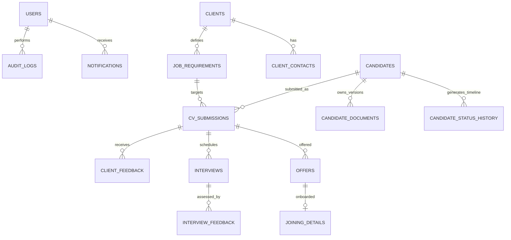

# RecruitFlow — Recruitment Management & Applicant Tracking Platform


**RecruitFlow** is a production-grade, enterprise SaaS Recruitment Management and Applicant Tracking Platform (ATS) designed to manage the entire talent acquisition lifecycle: from client requirements creation, candidate sourcing, multi-version CV storage, bulk folder parsing, client submissions pipeline, interview coordination, offer release, and WhatsApp outreach to candidate onboarding.

Repository: **[https://github.com/rachatur/recuitement_Dashboard](https://github.com/rachatur/recuitement_Dashboard)**

For local Windows, Linux, and macOS setup instructions, see [LOCAL_SETUP.md](LOCAL_SETUP.md).

Built with **FastAPI**, **SQLAlchemy**, **PostgreSQL 17**, **Vite**, **React 19**, **TypeScript**, and **Tailwind CSS**, RecruitFlow strictly enforces **never losing recruitment history** through immutable audit logs, sequential candidate timeline event tracking, and non-destructive document versioning.

---

## 🚀 Key Architectural Pillars & Features

1. **Unified Candidate Search & Real-Time Filtering**:
   - Search across **Candidate Name**, **Mobile / WhatsApp Number**, **Skills**, **Designation**, **Experience (Years)**, **Current Company**, and **Candidate Code**.
   - Filter by **Experience Brackets** (`0-1`, `1-3`, `3-5`, `5-8`, `8-12`, `12+` years), **Lifecycle Status**, and **WhatsApp Outreach Status**.

2. **Bulk CV Upload & Directory / Entire Folder Parsing**:
   - Upload individual files or select an **Entire Folder** (handles 5,000+ files) with automatic subfolder path sanitization.
   - Batch progress indicators, duplicate detection strategies (`skip`, `update`, `create_anyway`), and real-time counter metrics.

3. **Checkbox Selection & Batch Client Submission**:
   - **Select All** / Individual candidate checkboxes with a floating dynamic batch action bar.
   - Forward one or multiple candidates directly to active client **Job Requirements** with recruiter notes and immediate notification dispatch.

4. **Date-Wise Candidate & Client Submission History**:
   - Detailed timeline tracking of every candidate submission with **Client Name**, **Role / Position**, **Submission Date**, **Submission Code**, **Status Badge**, **Recruiter Name**, and **Remarks**.
   - Interview tracking and full date-wise status history.

5. **WhatsApp Outreach & Compliance Engine**:
   - Direct messaging and template broadcast via **Meta Graph Cloud API**.
   - Strict compliance consent tracking (`GRANTED`, `REVOKED`, `OPTED_OUT`), audit logs, and conversation threads.

6. **Multi-Tier Role-Based Access Control (RBAC)**:
   - Dedicated roles including **Super Admin**, **HR Recruiter**, **Admin**, **Team Lead**, **Recruiter**, **Client**, and **Hiring Manager**.
   - Pre-configured HR Recruiter credentials with full application access.

7. **Immutable Recruitment History & Audit Trail**:
   - Every candidate lifecycle transition, client submission, interview, and delete action is recorded in `audit_logs`, `candidate_status_history`, and `recruiter_activities`.

---

## 🛠️ Technology Stack

| Layer | Technologies |
|---|---|
| **Backend** | Python 3.11+, FastAPI, SQLAlchemy 2.0 (ORM), Pydantic v2, PyJWT, Bcrypt, Uvicorn |
| **Frontend** | React 19, TypeScript, Vite, Tailwind CSS, Recharts, Lucide Icons, Axios, date-fns |
| **Database** | PostgreSQL 17 (Relational Database with Foreign Keys, Cascades & B-Tree Indexes) |
| **Storage** | MinIO / AWS S3 Architecture with local filesystem fallback (`backend/uploads/`) |
| **Caching & Queues** | Redis 7 |
| **DevOps & Containers** | Docker, Docker Compose, Multi-stage Nginx containerization |
| **Testing** | Pytest, HTTPX, FastAPI TestClient, Vitest |

---

## 👥 Role-Based Access Control (RBAC) Matrix

| Module / Action | Super Admin | HR Recruiter | Admin | Team Lead | Recruiter | Client | Hiring Mgr |
|---|:---:|:---:|:---:|:---:|:---:|:---:|:---:|
| **Dashboard & Top 10 KPIs** | ✅ | ✅ | ✅ | ✅ | ✅ | ✅ *(Scoped)* | ✅ *(Scoped)* |
| **Client Management** | ✅ | ✅ | ✅ | ✅ | View / Add | Scoped View | Scoped View |
| **Job Requirements** | ✅ | ✅ | ✅ | ✅ | ✅ | Scoped View | Scoped View |
| **Candidate Talent Pool** | ✅ | ✅ | ✅ | ✅ | ✅ | Scoped | Scoped |
| **Multi-Version & Folder Upload** | ✅ | ✅ | ✅ | ✅ | ✅ | ❌ | ❌ |
| **CV Submissions Pipeline** | ✅ | ✅ | ✅ | ✅ | ✅ | Scoped View | Scoped View |
| **Client Feedback / Scoring** | ✅ | ✅ | ✅ | ✅ | View | ✅ | ✅ |
| **Interview Coordination** | ✅ | ✅ | ✅ | ✅ | ✅ | Scoped View | Scoped View |
| **WhatsApp Outreach & Messaging** | ✅ | ✅ | ✅ | ✅ | ✅ | ❌ | ❌ |
| **Candidate Deletion** | ✅ | ✅ | ✅ | ❌ | ❌ | ❌ | ❌ |
| **Immutable Audit Logs** | ✅ | ✅ | ✅ | ✅ | ❌ | ❌ | ❌ |

---

## 🔑 Pre-Seeded Demonstration Accounts

| Role | Email | Password | Scope / Description |
|---|---|---|---|
| **Super Admin** | `admin@recruitflow.com` | `AdminPassword123!` | Full system governance |
| **HR Recruiter** | `madhavi.singh@ethxsoftcon.com` | `Password123!` | Full application & recruitment access |
| **HR Recruiter** | `niky.sharma@ethxsoftcon.com` | `Password123!` | Full application & recruitment access |
| **Admin** | `sarah.admin@recruitflow.com` | `Password123!` | Operational administration |
| **Team Lead** | `marcus.lead@recruitflow.com` | `Password123!` | Team oversight & analytics |
| **Recruiter** | `alex.recruiter@recruitflow.com` | `Password123!` | Active talent sourcing |
| **Client** | `rachel.client@novatech.com` | `Password123!` | NovaTech Cloud (Scoped) |
| **Hiring Manager** | `david.hiring@apexfin.com` | `Password123!` | Apex Financial (Scoped) |

---

## ⚡ Quick Start with Docker

To run the complete platform with a single command:

```bash
docker compose up -d --build
```

- **Frontend Web Dashboard**: `http://localhost`
- **Backend API & Swagger Docs**: `http://localhost:8000/docs`
- **MinIO Storage Console**: `http://localhost:9001` (User: `minioadmin`, Pass: `minioadmin123`)

---

## 📄 License & Author

Developed for enterprise talent acquisition and recruitment lifecycle management.  
GitHub Repository: **[https://github.com/rachatur/recuitement_Dashboard](https://github.com/rachatur/recuitement_Dashboard)**

## 🧪 Automated Testing

RecruitFlow includes a complete pytest test suite testing Authentication, RBAC, Client Tenant Scoping, Candidate Timeline Immutability, and Submissions State Transitions.

```bash
cd backend
pytest -v
```

**Results**:
```
tests/test_auth.py::test_login_success PASSED
tests/test_auth.py::test_login_invalid_credentials PASSED
tests/test_auth.py::test_get_current_user_profile PASSED
tests/test_rbac.py::test_admin_can_access_users_list PASSED
tests/test_rbac.py::test_recruiter_cannot_access_users_list PASSED
tests/test_rbac.py::test_client_cannot_access_other_client_data PASSED
tests/test_candidates.py::test_create_candidate PASSED
tests/test_candidates.py::test_list_candidates_with_filters PASSED
tests/test_candidates.py::test_candidate_status_update_creates_timeline_history PASSED
tests/test_candidates.py::test_candidate_multi_version_cv_upload PASSED
tests/test_submissions.py::test_cv_submission_lifecycle PASSED
tests/test_submissions.py::test_client_feedback_recording PASSED
tests/test_submissions.py::test_invalid_status_transition_rejected PASSED
tests/test_analytics.py::test_dashboard_kpis_and_funnel PASSED
tests/test_analytics.py::test_time_series_analytics PASSED
tests/test_analytics.py::test_audit_logs_immutability PASSED

============================== 16 passed in 3.42s ==============================
```

---

## 📊 Recruitment Lifecycle Data Model



---

## 🛡️ License
Proprietary Enterprise Software — Developed for production-ready recruitment operations.
